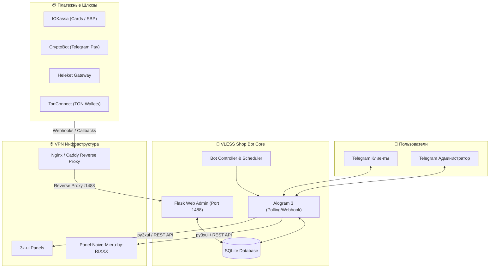

<div align="center" markdown>

# ⚡ VLESS Shop Bot (RIXXX Edition)

### Комплексный Telegram-бот для автоматизированной продажи VPN-конфигураций

<p align="center">
  <a href="#-особенности-rixxx-edition">Особенности</a> •
  <a href="#-команды-telegram-администратора">Команды бота</a> •
  <a href="#-быстрая-установка">Установка</a> •
  <a href="#-интеграция-с-панелью-rixxx">Интеграция с RIXXX</a> •
  <a href="#-настройка-платежных-шлюзов">Платежи</a> •
  <a href="#-управление-и-деплой">Docker</a>
</p>

[](LICENSE)
[](https://www.python.org/)
[](https://docs.aiogram.dev/)
[](https://www.docker.com/)
[](https://github.com/detkeroot/vless-shopbot-rixxx-edition)

</div>

---

**VLESS Shop Bot (RIXXX Edition)** — это форк и расширенная редакция популярного Telegram-бота для автоматической продажи VPN-подписок. Проект глубоко адаптирован для работы с панелями **[Panel-Naive-Mieru-by-RIXXX](https://github.com/cwash797-cmd/Panel-Naive-Mieru-by-RIXXX)** и **3x-ui**, оснащен удобной веб-панелью управления, мощным набором Telegram-команд для администратора и саппорта, поддержкой VIP-реферальных ставок и приемом платежей через ЮKassa, CryptoBot, Heleket и TON.

---

## ✨ Особенности RIXXX Edition

- 🚀 **Полная совместимость с Panel RIXXX & 3x-ui**:
  - Корректная работа API-интеграции для создания, продления и отзыва клиентов VLESS / NaiveProxy / Mieru / Hysteria2.
  - Поддержка проксирования веб-панели (порт `1488`) как через классический Nginx, так и через Caddy Reverse Proxy в составе панели RIXXX.
- 🛠️ **Расширенный Telegram Admin Suite**:
  - Быстрая выдача подписок пользователям прямо из чата Telegram (`/give`).
  - Система делегирования прав: назначение доверенных модераторов/саппортов на выдачу ключей (`/grant`, `/revoke`).
  - Управление доступом: блокировка и разблокировка пользователей (`/ban`, `/unban`).
  - Полное каскадное удаление пользователя (`/delete_user`) — удаляет ключи с физических серверов XUI/RIXXX и очищает профиль в БД (позволяет юзеру при необходимости заново протестировать пробный период).
  - Выгрузка базы данных в форматированный текстовый отчет `vpn_users_report.txt` (`/users`).
  - Автоматическая регистрация скоупа команд администратора в интерфейсе Telegram (`BotCommandScopeChat`).
- 💎 **Гибкая реферальная система (VIP-проценты)**:
  - Возможность назначать индивидуальный VIP-процент отчислений для партнеров, блогеров и инфлюенсеров (`/setref`, `/delref`).
  - Автоматический расчет вознаграждения при покупках и отображение персональной ставки в профиле реферала.
- 🏷️ **Чистый генератор Email для клиентов**:
  - Формирование структурированных идентификаторов без спецсимволов: `<username>_<user_id>_key<N>@<host>.bot` и `<username>_<user_id>_key<N>@trial@telegram.bot` для идеального порядка в панели управления.
- 💳 **Мульти-эквайринг и автоматизация оплат**:
  - **ЮKassa**: Банковские карты РФ, СБП, SberPay, фискализация чеков по 54-ФЗ.
  - **CryptoBot**: Прием USDT, TON, BTC и др. криптовалют в Telegram без сетевых комиссий.
  - **Heleket**: Мультивалютный крипто-шлюз.
  - **TonConnect**: Нативная интеграция с кошельками экосистемы TON (Tonkeeper, MyTonWallet).
- 🖥️ **Веб-панель "Все в одном" (Flask / Dark Theme)**:
  - Управление серверами/хостами, тарифами, промокодами, пользователями и логами транзакций.
  - Встроенная двухфакторная аутентификация (2FA / TOTP) для защиты входа в панель.

---

## 🏗️ Архитектура системы



---

## 📋 Команды Telegram Администратора

Команды доступны владельцу бота (указанному в `admin_telegram_id`), а команда `/give` также доступна пользователям с делегированными правами:

| Команда | Синтаксис | Описание |
| :--- | :--- | :--- |
| **Выдать подписку** | `/give <Telegram_ID> <дней>` | Генерирует и выдает готовый ключ на выбранное количество дней с отправкой в ЛС пользователю. |
| **Выдать права саппорту** | `/grant <Telegram_ID>` | Разрешает доверенному пользователю использовать команду `/give`. |
| **Забрать права саппорта** | `/revoke <Telegram_ID>` | Отзывает права на использование команды `/give`. |
| **Заблокировать** | `/ban <Telegram_ID>` | Блокирует пользователя в боте. |
| **Разблокировать** | `/unban <Telegram_ID>` | Снимает блокировку с пользователя. |
| **Удалить пользователя** | `/delete_user <Telegram_ID>` | Каскадно удаляет ключи юзера с серверов XUI/RIXXX и стирает запись из БД (сброс триала). |
| **Установить VIP-процент** | `/setref <Telegram_ID> <процент>` | Устанавливает персональный процент отчислений реферальной программы (например, `/setref 123456789 25`). |
| **Сбросить VIP-процент** | `/delref <Telegram_ID>` | Возвращает пользователя на стандартный системный процент рефералки. |
| **Выгрузка базы данных** | `/users` | Формирует и присылает файл `vpn_users_report.txt` со списком всех пользователей, статусами, ключами и ставками. |

---

## 🛠️ Быстрая установка

### Вариант 1: Автоматический скрипт установки (Рекомендуется)

Скрипт автоматически установит Docker, Docker Compose, Nginx, Certbot (SSL), клонирует репозиторий и сконфигурирует окружение:

```bash
curl -sSL https://raw.githubusercontent.com/detkeroot/vless-shopbot-rixxx-edition/main/install.sh | sudo bash
```

> **Примечание:** Если запустить скрипт повторно на сервере с уже установленным ботом, он автоматически выполнит `git pull` и пересоберет Docker-контейнеры.

---

### Вариант 2: Ручной запуск через Docker Compose

1. **Клонируйте репозиторий:**
   ```bash
   git clone https://github.com/detkeroot/vless-shopbot-rixxx-edition.git
   cd vless-shopbot-rixxx-edition
   ```

2. **Запустите контейнер:**
   ```bash
   docker-compose up -d --build
   ```

3. **Проверьте статус и логи:**
   ```bash
   docker-compose logs -f
   ```

Веб-панель будет доступна по адресу `http://IP_СЕРВЕРА:1488` (или по вашему домену при настройке Reverse Proxy).

---

## 🔗 Интеграция с панелью RIXXX

Если бот разворачивается на сервере, где уже установлена **Panel-Naive-Mieru-by-RIXXX**, админку бота можно удобно проксировать через Caddy на порт `1488`.

Добавьте хук в шаблон Caddy на сервере с панелью:

```bash
cat << 'HOOK' >> /opt/panel-naive-mieru/server/caddyTemplate.js

const _origRender = module.exports.render;
module.exports.render = function(cfg, users) {
    return _origRender(cfg, users) + "\n\nтвой_домен_для_бота.ru {\n  reverse_proxy 127.0.0.1:1488\n}\n";
};
HOOK
```

После добавления хука пересоберите конфигурацию панели:
```bash
bash /opt/panel-naive-mieru/update.sh --repair -y
```

---

## ⚙️ Первоначальная настройка

1. **Вход в панель управления**:
   - Перейдите по адресу `https://your-domain.com/login` (или `http://IP:1488/login`).
   - Стандартные данные для первого входа:
     - **Логин:** `admin`
     - **Пароль:** `admin`
2. **Смена пароля и 2FA**:
   - Перейдите в раздел **Настройки -> Настройки Панели**.
   - Обязательно смените логин и пароль, при необходимости подключите двухфакторную аутентификацию (Google Authenticator / 2FA App).
3. **Настройка Telegram**:
   - Укажите **Токен бота** (полученный в [@BotFather](https://t.me/BotFather)).
   - Укажите **Username бота** (без символа `@`).
   - Укажите ваш **Telegram ID Администратора** (узнать можно через [@userinfobot](https://t.me/userinfobot)).
4. **Подключение серверов (Хостов)**:
   - В разделе **Настройки** -> **Управление Хостами** введите данные подключения к вашей панели 3x-ui / RIXXX (URL, порт, логин, пароль).
5. **Создание тарифных планов**:
   - Создайте тарифные планы для добавленного хоста (например, *1 месяц — 150 ₽*, *3 месяца — 400 ₽*).
6. **Запуск бота**:
   - Нажмите **"Сохранить все настройки"**, затем в шапке панели нажмите зеленую кнопку **"Запустить Бота"**.

---

## 💳 Настройка платежных шлюзов

### 1. ЮKassa
1. В веб-панели перейдите в **Настройки -> Настройки Платежных Систем**.
2. Введите **Shop ID** и **Секретный ключ** из личного кабинета ЮKassa.
3. В кабинете ЮKassa настройте URL для вебхуков:
   ```
   https://your-domain.com/yookassa-webhook
   ```
   *(Если используется нестандартный порт, например 8443: `https://your-domain.com:8443/yookassa-webhook`)*

### 2. CryptoBot
1. Откройте [@CryptoBot](https://t.me/CryptoBot) в Telegram.
2. Перейдите в **Crypto Pay** -> **Создать приложение**.
3. Скопируйте **API Token** в настройки панели бота.
4. Включите вебхуки в приложении CryptoBot на URL:
   ```
   https://your-domain.com/cryptobot-webhook
   ```

---

## 💡 Управление и деплой

Все управление осуществляется через Docker Compose в директории проекта:

```bash
# Просмотр логов бота в реальном времени
docker-compose logs -f

# Перезапуск сервиса
docker-compose restart

# Остановка контейнера
docker-compose down

# Фоновый запуск после изменений
docker-compose up -d --build
```

---

## 📄 Лицензия и благодарности

- Исходный проект: [vless-shopbot](https://github.com/evansvl/vless-shopbot)
- RIXXX Edition & Enhancements: [detker](https://github.com/detkeroot)
- Распространяется под лицензией [MIT](LICENSE).
