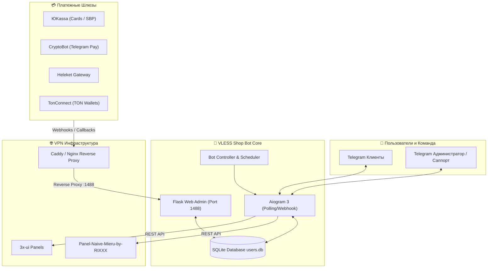

<div align="center" markdown>

# ⚡ VLESS Shop Bot (RIXXX Edition)

### Комплексный Telegram-бот для автоматизированной продажи VPN-конфигураций

<p align="center">
  <a href="#-особенности-rixxx-edition">Особенности</a> •
  <a href="#-команды-telegram-администратора">Команды бота</a> •
  <a href="#-быстрая-установка">Установка</a> •
  <a href="#-интеграция-с-панелью-rixxx">Интеграция с RIXXX</a> •
  <a href="#-настройка-платежных-шлюзов">Платежи</a> •
  <a href="#-faq-и-решение-проблем">FAQ</a> •
  <a href="#-управление-и-деплой">Docker</a>
</p>

[](LICENSE)
[](https://www.python.org/)
[](https://docs.aiogram.dev/)
[](https://www.docker.com/)
[](https://github.com/detkeroot/vless-shopbot-rixxx-edition)

</div>

---

**VLESS Shop Bot (RIXXX Edition)** — это открытая, расширенная редакция Telegram-бота для автоматизированной продажи VPN-доступа. Бот специально адаптирован для работы в связке с панелями **[Panel-Naive-Mieru-by-RIXXX](https://github.com/cwash797-cmd/Panel-Naive-Mieru-by-RIXXX)** и **3x-ui**.

Проект включает в себя встроенную веб-панель управления, продвинутый набор Telegram-команд для администратора и команды поддержки, гибкую систему персональных реферальных процентов (VIP-ставки), генератор чистых идентификаторов клиентов и автоматический прием платежей через популярные шлюзы (ЮKassa, CryptoBot, Heleket, TonConnect).

---

## ✨ Особенности RIXXX Edition

- 🚀 **Полная совместимость с Panel RIXXX & 3x-ui**:
  - Надежное взаимодействие через REST API для создания, продления и отзыва клиентов (VLESS, NaiveProxy, Mieru, Hysteria2).
  - Поддержка проксирования веб-панели (порт `1488`) через Caddy (в составе RIXXX) или классический Nginx.
  - Подробное руководство по интеграции доступно в [RIXXX_INTEGRATION.md](RIXXX_INTEGRATION.md).
- 🛠️ **Расширенный Telegram Admin Suite**:
  - Быстрая выдача подписок прямо из чата Telegram (`/give`).
  - Делегирование прав саппортам/модераторам на выдачу ключей (`/grant`, `/revoke`).
  - Управление доступом: блокировка и разблокировка нарушителей (`/ban`, `/unban`).
  - Полное каскадное удаление (`/delete_user`): стирает ключи из XUI/RIXXX и очищает БД для сброса триала.
  - Выгрузка базы данных в форматированный текстовый отчет `vpn_users_report.txt` (`/users`).
  - Автоматическая регистрация скоупа команд администратора в Telegram (`BotCommandScopeChat`).
- 💎 **Гибкая реферальная система (VIP-проценты)**:
  - Назначение персонального VIP-процента отчислений для конкретных партнеров и инфлюенсеров (`/setref`, `/delref`).
  - Автоматический расчет бонусов при покупках и отображение ставки в интерфейсе бота.
- 🏷️ **Чистая генерация Email для клиентов**:
  - Структурированные почтовые адреса без спецсимволов: `<username>_<user_id>_key<N>@<host>.bot` и `<username>_<user_id>_key<N>@trial@telegram.bot`.
- 💳 **Мульти-эквайринг и автоматизация оплат**:
  - **ЮKassa**: Банковские карты РФ, СБП, SberPay, фискальные чеки (54-ФЗ).
  - **CryptoBot**: Прием USDT, TON, BTC в Telegram без комиссий сетей.
  - **Heleket**: Мультивалютный крипто-эквайринг.
  - **TonConnect**: Подключение некастодиальных TON-кошельков (Tonkeeper, MyTonWallet).
- 🖥️ **Веб-панель "Все в одном" (Flask / Dark Theme)**:
  - Управление серверами/хостами, тарифами, промокодами, пользователями, балансами и транзакциями.
  - Защита входа через двухфакторную аутентификацию (2FA / TOTP).

---

## 🏗️ Архитектура системы



---

## 📋 Команды Telegram Администратора

Команды автоматически регистрируются в меню Telegram для ID, указанного в настройках (`admin_telegram_id`). Команда `/give` также доступна пользователям с правами саппорта:

| Команда | Синтаксис | Описание |
| :--- | :--- | :--- |
| **Выдать подписку** | `/give <Telegram_ID> <дней>` | Генерирует и выдает готовый ключ на выбранное количество дней с отправкой в ЛС пользователю. |
| **Выдать права саппорту** | `/grant <Telegram_ID>` | Разрешает доверенному пользователю использовать команду `/give`. |
| **Забрать права саппорта** | `/revoke <Telegram_ID>` | Отзывает права на использование команды `/give`. |
| **Заблокировать** | `/ban <Telegram_ID>` | Блокирует пользователя в боте. |
| **Разблокировать** | `/unban <Telegram_ID>` | Снимает блокировку с пользователя. |
| **Удалить пользователя** | `/delete_user <Telegram_ID>` | Каскадно удаляет ключи юзера с серверов XUI/RIXXX и стирает запись из БД (сброс триала). |
| **Установить VIP-процент** | `/setref <Telegram_ID> <процент>` | Устанавливает персональный процент отчислений реферальной программы (например, `/setref 123456789 25`). |
| **Сбросить VIP-процент** | `/delref <Telegram_ID>` | Возвращает пользователя на стандартный системный процент рефералки. |
| **Выгрузка базы данных** | `/users` | Формирует и присылает файл `vpn_users_report.txt` со списком всех пользователей, статусами, ключами и ставками. |

---

## 🛠️ Быстрая установка

### Вариант 1: Автоматический скрипт установки (Рекомендуется)

Скрипт проверяет зависимости, устанавливает Docker, Docker Compose, Nginx, Certbot (SSL), клонирует проект и запускает бота:

```bash
curl -sSL https://raw.githubusercontent.com/detkeroot/vless-shopbot-rixxx-edition/main/install.sh | sudo bash
```

> **Совет:** При повторном запуске скрипта на сервере он автоматически обновит код (`git pull`) и пересоберет контейнеры без потери данных.

---

### Вариант 2: Ручной запуск через Docker Compose

1. **Клонируйте репозиторий:**
   ```bash
   git clone https://github.com/detkeroot/vless-shopbot-rixxx-edition.git
   cd vless-shopbot-rixxx-edition
   ```

2. **Запустите контейнер:**
   ```bash
   docker-compose up -d --build
   ```

3. **Проверьте статус и логи:**
   ```bash
   docker-compose logs -f
   ```

Веб-панель будет доступна по адресу `http://IP_СЕРВЕРА:1488` (или по домену через Reverse Proxy).

---

## 🔗 Интеграция с панелью RIXXX

Если бот работает на том же сервере, что и **Panel-Naive-Mieru-by-RIXXX**, админку бота можно проксировать через встроенный веб-сервер Caddy:

1. Добавьте хук в шаблон Caddy:
   ```bash
   cat << 'HOOK' >> /opt/panel-naive-mieru/server/caddyTemplate.js

   const _origRender = module.exports.render;
   module.exports.render = function(cfg, users) {
       return _origRender(cfg, users) + "\n\nbot.your-domain.com {\n  reverse_proxy 127.0.0.1:1488\n}\n";
   };
   HOOK
   ```
2. Пересоберите конфигурацию панели:
   ```bash
   bash /opt/panel-naive-mieru/update.sh --repair -y
   ```

> 📖 Подробное руководство со всеми нюансами и схемами подключения смотрите в **[RIXXX_INTEGRATION.md](RIXXX_INTEGRATION.md)**.

---

## ⚙️ Первоначальная настройка

1. **Вход в панель управления**:
   - Перейдите по адресу `https://your-domain.com/login` (или `http://IP:1488/login`).
   - Стандартные данные для первого входа:
     - **Логин:** `admin`
     - **Пароль:** `admin`
2. **Смена пароля и 2FA**:
   - Перейдите в раздел **Настройки -> Настройки Панели**.
   - Смените логин и пароль, подключите двухфакторную аутентификацию (2FA / TOTP).
3. **Настройка Telegram**:
   - Укажите **Токен бота** (полученный в [@BotFather](https://t.me/BotFather)).
   - Укажите **Username бота** (без `@`).
   - Укажите ваш **Telegram ID Администратора** (узнать можно через [@userinfobot](https://t.me/userinfobot)).
4. **Подключение серверов (Хостов)**:
   - В разделе **Настройки** -> **Управление Хостами** введите данные подключения к вашей панели 3x-ui / RIXXX (URL, порт, логин, пароль, Inbound ID).
5. **Создание тарифных планов**:
   - Создайте тарифные планы для добавленного хоста (например, *1 месяц — 150 ₽*, *3 месяца — 400 ₽*).
6. **Запуск бота**:
   - Нажмите **"Сохранить все настройки"**, затем в шапке панели нажмите зеленую кнопку **"Запустить Бота"**.

---

## 💳 Настройка платежных шлюзов

### 1. ЮKassa
1. В веб-панели перейдите в **Настройки -> Настройки Платежных Систем**.
2. Введите **Shop ID** и **Секретный ключ** из личного кабинета ЮKassa.
3. В кабинете ЮKassa настройте URL для вебхуков:
   ```
   https://your-domain.com/yookassa-webhook
   ```

### 2. CryptoBot
1. Откройте [@CryptoBot](https://t.me/CryptoBot) в Telegram.
2. Перейдите в **Crypto Pay** -> **Создать приложение**.
3. Скопируйте **API Token** в настройки панели бота.
4. Включите вебхуки в приложении CryptoBot на URL:
   ```
   https://your-domain.com/cryptobot-webhook
   ```

---

## ❓ FAQ и решение проблем

<details>
<summary><b>1. Где найти Inbound ID в панели RIXXX / 3x-ui?</b></summary>

В веб-интерфейсе панели перейдите в раздел **"Подключения" (Inbounds)**. Номер в первой колонке таблицы или в деталях подключения и является `Inbound ID` (по умолчанию `1`).
</details>

<details>
<summary><b>2. Бот не реагирует на команду /give от саппорта</b></summary>

Убедитесь, что главный администратор предварительно выдал права этому пользователю командой `/grant <Telegram_ID>`. Также проверьте, что в панели добавлен хотя бы один активный хост.
</details>

<details>
<summary><b>3. Как сбросить тестовый период пользователю?</b></summary>

Отправьте команду `/delete_user <Telegram_ID>`. Бот удалит все старые ключи с сервера и сотрет запись о пользователе из базы данных. После этого пользователь сможет заново взять пробный период командой `/start`.
</details>

<details>
<summary><b>4. Как перенести базу данных при обновлении сервера?</b></summary>

База данных хранится в локальном файле `users.db` в корне проекта. Для переноса достаточно скопировать этот файл на новый сервер в директорию бота.
</details>

---

## 💡 Управление и деплой

```bash
# Просмотр логов бота в реальном времени
docker-compose logs -f

# Перезапуск сервиса
docker-compose restart

# Остановка контейнера
docker-compose down

# Фоновый запуск после изменений
docker-compose up -d --build
```

---

## 📄 Лицензия и благодарности

- **Оригинальный бот:** [vless-shopbot](https://github.com/evansvl/vless-shopbot) от [@evansvl](https://github.com/evansvl).
- **Панель управления VPN:** [Panel-Naive-Mieru-by-RIXXX](https://github.com/cwash797-cmd/Panel-Naive-Mieru-by-RIXXX) от [@cwash797-cmd](https://github.com/cwash797-cmd).
- **RIXXX Edition:** [detker](https://github.com/detkeroot).
- Проект распространяется под открытой лицензией [GNU General Public License v3.0](LICENSE).
