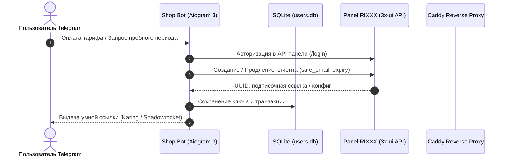

# Руководство по интеграции VLESS Shop Bot с Panel-Naive-Mieru-by-RIXXX

Данное руководство описывает процесс связки и совместной работы Telegram-бота **VLESS Shop Bot (RIXXX Edition)** с панелью управления **[Panel-Naive-Mieru-by-RIXXX](https://github.com/cwash797-cmd/Panel-Naive-Mieru-by-RIXXX)**.

---

## 📌 Принцип работы интеграции



1. Бот взаимодействует с панелью по REST API, аналогичному протоколу 3x-ui.
2. При создании ключа бот автоматически формирует безопасный идентификатор клиента:
   - Для регулярных подписок: `<username>_<user_id>_key<N>@<host>.bot`
   - Для пробного периода: `<username>_<user_id>_key<N>@trial@telegram.bot`
3. Бот получает прямую подписочную ссылку (`sub://` или VLESS/Naive/Mieru/Hysteria2) и передает её клиенту в красивом формате.

---

## 🚀 Сценарий 1: Бот и Панель RIXXX на одном сервере

Если вы разворачиваете бота на том же VPS, где уже работает панель RIXXX:

### Шаг 1. Настройка проксирования через Caddy

Панель RIXXX использует веб-сервер Caddy для управления SSL-сертификатами и маршрутизацией трафика. Чтобы панель управления ботом (порт `1488`) была доступна по вашему домену, добавьте хук в шаблон Caddy:

```bash
cat << 'HOOK' >> /opt/panel-naive-mieru/server/caddyTemplate.js

const _origRender = module.exports.render;
module.exports.render = function(cfg, users) {
    return _origRender(cfg, users) + "\n\nbot.your-domain.com {\n  reverse_proxy 127.0.0.1:1488\n}\n";
};
HOOK
```
> ⚠️ Замените `bot.your-domain.com` на ваш реальный домен/поддомен, A-запись которого указывает на IP этого сервера.

### Шаг 2. Применение изменений в панели

Выполните команду пересборки конфигурации панели:

```bash
bash /opt/panel-naive-mieru/update.sh --repair -y
```

Caddy автоматически получит валидный Let's Encrypt SSL-сертификат для вашего домена бота и начнет проксировать запросы к порту `1488`.

### Шаг 3. Запуск контейнера бота

В директории с ботом выполните:

```bash
docker-compose up -d --build
```

---

## 🌐 Сценарий 2: Бот и Панель RIXXX на разных серверах

Если бот находится на отдельном VPS или хостинге:

1. Убедитесь, что порт панели RIXXX (по умолчанию `2053` или заданный при установке) доступен извне либо защищен белым списком IP.
2. На сервере бота выполните быструю установку:
   ```bash
   curl -sSL https://raw.githubusercontent.com/detkeroot/vless-shopbot-rixxx-edition/main/install.sh | sudo bash
   ```
3. Скрипт поднимет Nginx с автоматическим SSL-сертификатом и запустит контейнер бота.

---

## ⚙️ Настройка хоста в панели управления ботом

1. Откройте веб-панель бота: `https://bot.your-domain.com/login` (логин: `admin`, пароль: `admin`).
2. Перейдите на вкладку **"Настройки"**.
3. В левой колонке **"Управление Хостами"** заполните блок **"Добавить новый хост"**:
   - **Название хоста:** Произвольное имя (например, `Финляндия RIXXX` или `Германия Naive`).
   - **URL Хоста:** 
     - Если на одном сервере: `http://127.0.0.1:2053` (или локальный порт панели).
     - Если на разных серверах: `https://panel.your-domain.com:2053` (внешний адрес панели).
   - **Логин хоста:** Логин администратора панели RIXXX.
   - **Пароль хоста:** Пароль администратора панели RIXXX.
   - **ID Inbound:** Номер подключения/инбаунда из панели RIXXX (по умолчанию `1`).
4. Нажмите кнопку **"Добавить Хост"**.
5. Ниже в блоке **"Управление Тарифами"** создайте тарифные планы для добавленного сервера (например, `1 месяц` — `150` RUB, `3 месяца` — `400` RUB).
6. В шапке сайта нажмите зеленую кнопку **"Запустить Бота"**.

---

## 🛠️ Возможные проблемы и их решение

### 1. Ошибка подключения к API панели (`Error logging in to host`)
- **Причина:** Неверный URL, логин или пароль, либо порт панели закрыт файрволом (`ufw`/`iptables`).
- **Решение:** Проверьте доступность панели с сервера бота через `curl -I http://127.0.0.1:2053` (или внешний IP). Убедитесь, что логин и пароль администратора совпадают с данными входа в панель RIXXX.

### 2. Ключ создается в панели, но клиент не получает ссылку
- **Причина:** В инбаунде панели не настроен корректный домен или подписочный шаблон.
- **Решение:** Проверьте настройки инбаунда в веб-интерфейсе RIXXX (раздел *Подписки* / *Inbounds*) и убедитесь, что тестовый клиент из панели генерирует рабочую ссылку.

### 3. Не приходят вебхуки оплат
- **Причина:** Внешний веб-сервер (Nginx / Caddy) не пропускает POST-запросы к эндпоинтам `/yookassa-webhook` или `/cryptobot-webhook`.
- **Решение:** Проверьте, что в настройках ЮKassa и CryptoBot указан полный HTTPS URL с доменом (например, `https://bot.your-domain.com/yookassa-webhook`).
